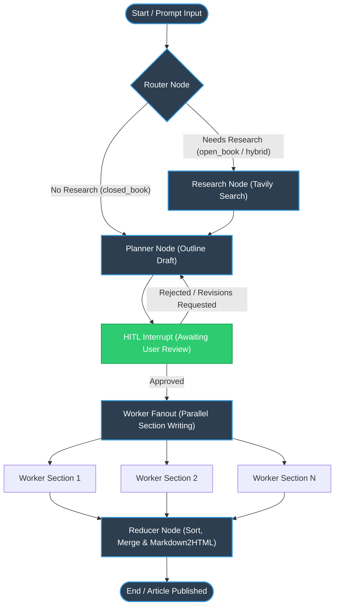

# 🤖 Blog AI Agent ✨

> A state-of-the-art, multi-agent blog generation platform designed with **editorial precision**, **hybrid web-research capability**, and **Human-in-the-Loop (HITL)** orchestration.

---

[](https://fastapi.tiangolo.com/)
[](https://github.com/langchain-ai/langgraph)
[](https://nextjs.org/)
[](https://tailwindcss.com/)
[](https://www.docker.com/)


---

## 📖 Table of Contents

- [🌟 Features Overview](#-features-overview)
- [✨ UI Showcase](#-ui-showcase)
- [🏗️ Multi-Agent Architecture (LangGraph)](#-multi-agent-architecture-langgraph)
- [🛠️ Tech Stack](#️-tech-stack)
- [💾 Database Schema](#-database-schema)
- [🚀 Quick Start & Setup](#-quick-start--setup)
  - [1. Backend Setup](#1-backend-setup)
  - [2. Frontend Setup](#2-frontend-setup)
- [🐳 Docker Containerization](#-docker-containerization)
- [🤝 Contributing & License](#-contributing--license)

---

## 🌟 Features Overview

The **Blog AI Agent** is not just another simple text generator. It is a full-fledged, commercial-grade publication assistant that mirrors a professional editorial desk.

*   **智能 Multi-Agent Orchestration**: Powered by **LangGraph**, the backend manages advanced workflows featuring conditional routing, parallel section generation (map-reduce/fanout), and state synchronization.
*   **🌐 Deep Research & Recency Enforcement**: Integrates with the **Tavily Search API** to fetch real-world data, compile structured *EvidencePacks*, and automatically apply hard recency filters (e.g., keeping only fresh news within a 7-day, 45-day, or custom window).
*   **🧑‍💻 Human-in-the-Loop (HITL)**: Native graph interruption allows users to inspect the generated outline (Plan) before any content is written. Users can approve the plan directly or provide feedback and suggestions to trigger an automatic layout redesign.
*   **⚡ Parallel Section Writing (Fanout)**: Once the outline is approved, the main graph spawns parallel workers concurrently writing separate blog sections, respecting the targeted constraints, tone, and word counts.
*   **🎨 Premium Glassmorphism Frontend**: A Next.js visual dashboard utilizing a high-end dark interface, real-time generation trackers, a responsive Plan Editor, an rich Article Preview renderer, and full quota management.
*   **🔐 Production Ready Security**: JWT authentication for user signup/login, route guards, SQLite/SQLAlchemy schemas, and strict word count quota/blog limit enforcement.

---

## ✨ UI Showcase

Here is a visual overview of the premium, responsive dashboard of the **Blog AI Agent**:

### 1. 🚀 Main Prompt Dashboard
A sleek, modern interface allowing users to submit new blog topics, select targeted writing tones, and view active status indicators.
<p align="center">
  
</p>

### 2. 🧑‍💻 Human-in-the-Loop Outline Approval & Draft Generation
Native graph interruption allows users to inspect and approve the dynamically generated blog outline, tone, sections, and targeted audience before starting any generation.
<p align="center">
  
</p>

### 3. 💾 Previous Blogs Card Grid
A responsive archive system showing beautiful card views of all previously generated blog posts alongside their status and metadata.
<p align="center">
  
</p>

### 4. 📝 Rendered Article View
A premium detailed article preview screen showing clean HTML rendered blog output containing dynamically embedded assets and responsive typography.
<p align="center">
  
</p>

### 5. 💳 Plans & Pricing Options
Fully interactive pricing tier selection page for tier subscription limits and features.
<p align="center">
  
</p>

---

## 🏗️ Multi-Agent Architecture (LangGraph)

The core strength of the Blog AI Agent lies in its modular LangGraph architecture. The graph coordinates different specialities:

1.  **Router**: Analyzes the user's prompt and decides the search mode (`closed_book`, `open_book`, or `hybrid`) and queries.
2.  **Research Node**: Executes parallel search queries via Tavily, cleans links, builds structured evidence, and filters for recency.
3.  **Planner**: Generates a high-quality blog draft outline containing a creative title, targeted audience structure, exact tones, and specific tasks per section.
4.  **HITL Interrupt**: Halts graph execution to request user confirmation. Resumes dynamically based on approval or revisions.
5.  **Worker Fanout**: Dynamically splits the approved outline and feeds each task to concurrent worker nodes.
6.  **Reducer Node**: Gathers all parallel section outputs, sorts them chronologically, converts Markdown to clean HTML, and sanitizes output to prevent XSS.

### 📊 LangGraph Workflow Diagram



#### 🗺️ Excalidraw Architecture Flowchart
A detailed structural visualization of the core multi-agent graph execution flow, routing patterns, and secondary sub-graphs:
<p align="center">
  
</p>

---

## 🛠️ Tech Stack

### Backend (`/BE`)
*   **Framework**: FastAPI (Asynchronous endpoints, Background Tasks)
*   **Orchestration**: LangGraph (v1.1.6), LangChain
*   **LLM Services**: Groq (Llama-3.3-70b-versatile, Llama-4-scout) or Google Gemini
*   **Database**: SQLite with SQLAlchemy ORM (aiosqlite)
*   **Checkpointer**: AsyncSqliteSaver (maintaining state persistence across server restarts)
*   **Auth**: JWT (python-jose, bcrypt)
*   **Migration**: Alembic

### Frontend (`/FE`)
*   **Framework**: Next.js (App Router, React 19)
*   **Language**: TypeScript
*   **Styling**: Tailwind CSS v4, Lucide React, Shadcn/UI (Radix Primitives)
*   **State Management**: Zustand
*   **Feedback**: Sonner (toasts), Embla Carousel

---

## 💾 Database Schema

The database relies on two highly optimized tables:

### `BlogThread` Table
Tracks LangGraph thread runs, prompt inputs, final articles, and media URLs.
| Column | Type | Description |
| :--- | :--- | :--- |
| `id` | `Integer (PK)` | Auto-incrementing identifier |
| `thread_id` | `String (Unique, Index)` | LangGraph unique thread state ID |
| `user_id` | `String (Index)` | Owner of the blog generation run |
| `topic` | `String` | Original search/prompt query |
| `content` | `Text` | Rendered & sanitized HTML content |
| `markdown_content` | `Text` | Raw markdown output for references |
| `status` | `String` | Lifecycle: `processing`, `awaiting_approval`, `completed`, `error` |
| `image_urls` | `JSON` | Integrated Unsplash photos/meta arrays |

### `User` Table
Manages secure auth, plans, and quota metrics.
| Column | Type | Description |
| :--- | :--- | :--- |
| `id` | `Integer (PK)` | Auto-incrementing identifier |
| `name` | `String` | Display user name |
| `email` | `String (Unique, Index)` | Login email credentials |
| `password` | `String` | Bcript salted secure hash |
| `plan_type` | `String` | Account tier (e.g., `basic`, `premium`) |
| `usage_metrics` | `JSON` | Usage logs, monthly generated limits, and quotas |

---

## 🚀 Quick Start & Setup

### 1. Backend Setup

Ensure you have **Python 3.10 or 3.11** installed.

#### Step A: Configure Environment Variables
Inside `BE/` directory, create a `.env` file based on `.env.example`:
```env
ENVIRONMENT=development
DATABASE_URL=sqlite:///./blog.db
ALLOWED_HOSTS=http://localhost:3000,http://127.0.0.1:3000
JWT_SECRET=your-super-long-secure-random-jwt-secret-string
SECRET_KEY=your-super-long-secure-random-session-secret-string
GROQ_API_KEY=gsk_your_groq_api_key
TAVILY_API_KEY=tvly-your_tavily_search_api_key
UNSPLASH_ACCESS_KEY=your_optional_unsplash_access_key
```

#### Step B: Install dependencies and Initialize Database
Using standard pip:
```bash
# Navigate to Backend
cd BE

# Create Virtual Environment
python -m venv venv
venv\Scripts\activate   # On Windows
source venv/bin/activate # On Unix/macOS

# Install dependencies
pip install -r requirements.txt

# Run initial database initialization
python init_db.py
```

#### Step C: Run development server
```bash
python main.py
```
The backend API will be available at **`http://localhost:8000`**. You can inspect the interactive OpenAPI documentation at **`http://localhost:8000/docs`**.

---

### 2. Frontend Setup

Ensure you have **Node.js 18+** installed.

#### Step A: Configure Environment Variables
Inside `FE/` directory, create a `.env` file:
```env
NEXT_PUBLIC_API_BASE_URL=http://localhost:8000
```

#### Step B: Install packages and Run Dev Server
```bash
# Navigate to Frontend
cd FE

# Install dependencies
npm install

# Run Frontend Dev Server
npm run dev
```
The Frontend website will boot at **`http://localhost:3000`**.

---

## 🐳 Docker Containerization

Both the Frontend and Backend are fully Dockerized for standard environments.

### Build and Run Backend
```bash
cd BE
docker build -t blog-ai-backend .
docker run -p 8000:8000 --env-file .env blog-ai-backend
```

### Build and Run Frontend
```bash
cd FE
docker build -t blog-ai-frontend .
docker run -p 3000:3000 --env-file .env blog-ai-frontend
```

---

## 🤝 Contributing & License

Feel free to open issues or pull requests to enhance the agent orchestration flow or frontend interface design. 

This project is licensed under the [MIT License](LICENSE).
